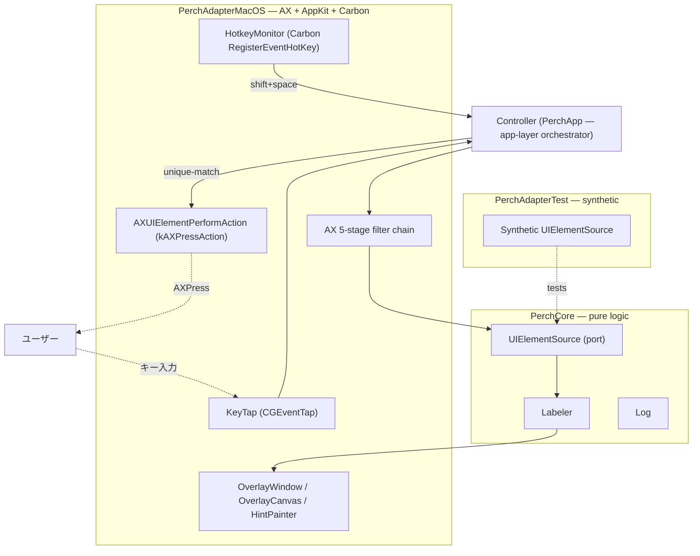

# 用語集 — perch のユビキタス言語

perch を構成する各パーツの **正規の呼び名** をまとめた規範ドキュメント。
**コード・ドキュメント・コミットメッセージ・PR タイトル・Claude Code への
プロンプト、すべてここに載っている名前のみを使う**。同義語は揺らぎを生む。
1 つに決めて、それで通す。

なお **正規名は英語のまま** 保持する。コード識別子・設定キー・CLI フラグ
（`UIElementSource`, `HotkeyMonitor`, `[hotkey].active`, `ax --dump` など）
と一対一に対応させるため。日本語化するのは説明文だけ。

用語が足りなければ、その用語を導入する PR で同時にこのファイルへ追記する。
用語名を変える場合は、コード・ドキュメント・このファイルを **同一 PR で**
書き換える。

> 各エントリの形式: **正規名**, 1〜2 行の定義, 設定 / コードでの所在,
> そして `Don't call it:` 行 — このエントリが置き換える誤った呼び名のリスト。

---

## アーキテクチャ全体像

perch は **ヘキサゴナル 3 層分割**（[docs/architecture.md](architecture.md)）。
下の図は層と主要な seam、そして hint mode のキーストロークが辿る経路を示す。

---

## レイヤー / モジュール

### PerchCore
**純ロジック層**。CoreGraphics OK、AppKit / AX / Carbon は持ち込まない。
XCTest で単体検証可能。
- 場所: [`Sources/PerchCore/`](../Sources/PerchCore/)
- 含むもの: `Models`, `UIElementSource` protocol, `Labeler`, `Log`
  （`Controller` は app 層 [`Sources/PerchApp/`](../Sources/PerchApp/)・config の parse は外部 swift-toml-edit `Toml`）
- **Don't call it:** domain layer, business logic, ドメイン層

### PerchAdapterMacOS
**OS adapter**。AX 列挙、Carbon `RegisterEventHotKey`、`NSPanel` overlay、
`AXPress` のすべてがここに閉じる。
- 場所: [`Sources/PerchAdapterMacOS/`](../Sources/PerchAdapterMacOS/)
- **Don't call it:** native adapter, ax adapter, AX 層

### PerchAdapterTest
**synthetic UIElementSource** を提供する end-to-end labeling test 用 adapter。
- 場所: [`Sources/PerchAdapterTest/`](../Sources/PerchAdapterTest/)
- **Don't call it:** mock adapter, fake adapter, モックアダプタ

### UIElementSource (port)
Core と Adapter の **唯一の seam**（hexagonal port）。Controller は
`UIElementSource` のみを見る。新規列挙戦略（Electron AX / CGWindowList
fallback 等）は新しい conformer として追加し、Core には `#if` を入れない。
- 定義: [`Sources/PerchCore/UIElementSource.swift`](../Sources/PerchCore/UIElementSource.swift)
- **Don't call it:** element provider, ax source, 列挙ソース

---

## ドメインモデル

### hint
**画面上にラベル付きで表示される 1 つのクリック対象**。AX `UIElement` +
割当てられた `label` + 描画矩形のセット。`hint mode` の主役。
- コード: `Hint` 値型, `Hint.label`
- **Don't call it:** target, marker, tag, ターゲット

### label
hint に割当てられた **短い文字列**（1〜2 文字）。これを順にタイプすると
そのhint がクリックされる。
- 不変条件: **single-letter labels は two-letter labels の prefix と
  ぶつからない**（`Labeler` がアルファベット末尾を prefix letter に予約）
- コード: [`Sources/PerchCore/Labeler.swift`](../Sources/PerchCore/Labeler.swift)
- **Don't call it:** key, code, hint key, ヒントキー

### UIElement
1 つのクリック可能 AX エレメント。**`PerchCore` 側は値型として保持**、
adapter 側が `liveById: [String: AXUIElement]` の side-table を持って
`act(id:as:)` 時に lookup する。Core に `AXUIElement` を **持ち込まない**。
- id 形式: `"<pid>:<seq>"`（`seq` は enumeration スコープの monotonic counter）
- **Don't call it:** ax element, ui node, AX ノード

### AX target
**hint mode が作用するウィンドウ**。`activate()` 時の
`NSWorkspace.frontmostApplication` で **一度だけ** 解決し、その後 focus が
動いても元の AX target を見続ける。
- **Don't call it:** focused window, active window, frontmost window
  （実装の途中段階を指す時のみ可）

### action mode
**修飾キーで切り替わる resolution アクション**:
- 修飾なし → `.press`（既定 = `AXUIElementPerformAction(kAXPressAction)`）
- Cmd → `.copyTitle` / Alt → `.focus` / Shift → `.rightClick`
- Ctrl は **cancel**（システムショートカット保護）
- 解決ロジック: `actionFor(flags:)` in
  [`OverlayWindow.swift`](../Sources/PerchAdapterMacOS/OverlayWindow.swift)
- **Don't call it:** modifier mode, chord, モディファイア組合せ

### unique-match
タイプ中の文字列が **1 つの [[label]] にしか合致しない瞬間**、即座に発火する
振る舞い。`single-letter` ≠ `two-letter prefix` invariant が前提。
- **Don't call it:** prefix match, instant fire, 確定マッチ

---

## 入力 / 描画

### HotkeyMonitor
**起動トリガ**を担う Carbon `RegisterEventHotKey` ラッパ。NSEvent global
monitor は使わない（passive で event を swallow できないため、focused text
field に space が入ってしまう）。
- 設定キー: `[hotkey].active`（`combo` ではない / typo は default に silent
  fallback）
- コード: [`Sources/PerchAdapterMacOS/HotkeyMonitor.swift`](../Sources/PerchAdapterMacOS/HotkeyMonitor.swift)
- **Don't call it:** activation hotkey, global hotkey（一般名としては可）,
  アクティベーションキー

### KeyTap
**hint mode 中のキー捕捉** に使う `CGEventTap`。System-wide に key を捕り、
`nil` を返して swallow しつつ perch を activate しない。`NSApp.activate` +
`NSEvent` local monitor を使わない理由は、focus が "ユーザーの足元から
持ち上がる" UX 違和感を避けるため。
- コード: [`Sources/PerchAdapterMacOS/KeyTap.swift`](../Sources/PerchAdapterMacOS/KeyTap.swift)
- **Don't call it:** key listener, key handler, キーハンドラ

### OverlayWindow / OverlayCanvas / HintPainter
hint を描画する **唯一の UI surface**。`NSPanel`（`[.borderless,
.nonactivatingPanel]`）に `NSVisualEffectView`（`.hudWindow`,
`.behindWindow`）を下、`HintPainter` を上に重ねる two-layer canvas。
- 場所: [`Sources/PerchAdapterMacOS/OverlayWindow.swift`](../Sources/PerchAdapterMacOS/OverlayWindow.swift)
- **Don't call it:** hint hud, overlay panel, ヒント表示

### pill
1 つの [[label]] を表す **角丸の小カード**。10pt corner radius を
`NSBezierPath(roundedRect:xRadius:yRadius:)` で描画（layer-level
`cornerRadius` は HiDPI で破綻する）。idle と matched で枠 / glow が変化。
- **Don't call it:** chip, badge, hint card, バッジ, チップ

### scale-in animation
hint mode 起動時の 150ms `0.85 → 1.0` ease-out cubic 拡大アニメーション。
ブラー mask を 1/60s で re-layout して painter と lockstep に保つ。
- 設定: `[overlay].anim-enabled`
- **Don't call it:** zoom-in, intro animation, ズームイン

### miss flash
未マッチ keystroke を `typed` に保持しつつ overlay を 200ms 赤く点滅させる
UI フィードバック。
- 駆動: `flashThenCancel` in `OverlayWindow`
- **Don't call it:** error flash, red flash, エラーフラッシュ

### theme palette
[[pill]] の background / primary / foreground + フォント種別を表現するパレット。
静的カタログは共有ライブラリ **sill** の `ThemeSpec` (`canonicalThemeNames` —
terminal / dracula / … + クロスアプリの chomp / rainbow) を、perch 側で 1 つの
app 固有オーバーレイ (pill 半透明 = `perchPillAlpha` — sill の `isLight` から
導出) を上乗せして解決 (`perchThemeSpec`)。miss flash 色は sill の `error`
ロールをそのまま使用。`system` は perch 独自の dark-pill spec。ユーザー定義
(`[overlay.themes.<name>]` — 詳細は [[custom palette]]) は full `ThemeSpec`。
facet とカタログを完全共有 (background / primary / foreground / font 一致)。
- 場所: [`Sources/PerchCore/Theme.swift`](../Sources/PerchCore/Theme.swift)
  (bridge) / sill `Palette` module (カタログ)
- 設定: `[overlay].theme`
- **Don't call it:** colorway, skin, color theme

### pill shape
[[pill]] の body geometry プリセット — pill / square / circle /
underline / tag。theme パレット (色) とは直交する knob。
- 設定: `[overlay].pill-shape`
- 解決: `HintPainter.shapeFor(cfg:hint:rect:)`
- **Don't call it:** pill geometry, hint shape

### appear effect
overlay 出現時のアニメーション (none / pop / cascade / fade-in / drop-in
/ bloom / random)。`pop` は 150ms scale-in (旧 [[scale-in animation]])。
cascade は per-pill 時間差を加算してウェーブ感を出す。
- 設定: `[overlay.effect].appear`
- 駆動: `OverlayCanvas.currentAppearState`
- **Don't call it:** intro animation, entry animation

### match effect
hint resolve 時に勝者 pill に流れるアニメーション。none / fade / explode
/ drop / rise / slide-left / slide-right / vibrate / fireworks /
confetti / random。AXPress と並列で発火するのでクリック遅延無し。
- 設定: `[overlay.effect].match`
- 駆動: `OverlayCanvas.animateMatch`
- **Don't call it:** resolve animation, click effect

### unmatch effect
[[miss flash]] の上に重ねるアニメ (shake / vibrate / fade / drop / 等)。
赤フラッシュ window を共有しつつモーションで「ブー！」感を強化する。
- 設定: `[overlay.effect].unmatch`
- 駆動: `OverlayCanvas.animateUnmatch`
- **Don't call it:** miss animation, error effect

### narrow effect
typed prefix の絞り込みで消える pill ごとに走る "ghost" アニメーション。
fireworks / confetti は負荷の都合で fade に自動降格。
- 設定: `[overlay.effect].narrow`
- 駆動: `GhostDriver` ([`Sources/PerchAdapterMacOS/GhostDriver.swift`](../Sources/PerchAdapterMacOS/GhostDriver.swift))
- **Don't call it:** filter animation, exit effect

### effect intensity
全演出系の **振幅 倍率** スケーラ (subtle 0.6× / normal 1.0× / bold 1.6×
/ wild 2.5×)。duration ではなく explode の拡大率 / shake の振れ幅 /
particle の速度に効く。wand 互換語彙。
- 設定: `[overlay.effect].intensity`

### duration scale
全演出の **時間** 倍率 (0.1..5.0)。screencast 用は 2.5+、snappy 派は
0.5 以下。赤フラッシュ window も連動。
- 設定: `[overlay.effect].duration-scale`

### border cycle
[[pill]] 周囲のネオン ボーダーが色相を周期回転するエフェクト。facet の
`[border]` 移植。30Hz tick で hue を回し続ける。
- 設定: `[overlay.border]` (effect / glow / width / cycle-seconds)
- 駆動: `OverlayCanvas.startBorderCycle`
- **Don't call it:** rainbow border, hue rotation

### modifier badge
hint mode 中、修飾キー押下時に各 pill の右上隅に⌃⌥⇧⌘グリフ (+ オプションで
"Copy" / "Right" / "Focus" / "Chain" のアクション動詞) を描画する補助 UI。
- 設定: `[overlay].show-modifier-badge` (off / glyph / action)
- 駆動: `HintPainter.drawModifierBadge` + `KeyTap.onFlagsChanged`
- **Don't call it:** modifier glyph, action label

### ParticleDriver
fireworks / confetti エフェクトを担当する独立 `@MainActor` クラス。
emitter 点リストを受け取り 60Hz で粒子の (x, y, vx, vy, alpha) を進める。
- 場所: [`Sources/PerchAdapterMacOS/ParticleDriver.swift`](../Sources/PerchAdapterMacOS/ParticleDriver.swift)
- **Don't call it:** particle system, fireworks renderer

### GhostDriver
narrow エフェクトの ghost pill 群を担当する独立クラス。複数 spawn を
同時管理し、各 ghost が duration 経過で list から外れる。
- 場所: [`Sources/PerchAdapterMacOS/GhostDriver.swift`](../Sources/PerchAdapterMacOS/GhostDriver.swift)
- **Don't call it:** ghost manager, exit driver

### SoundPlayer
match / unmatch / activate の音声フィードバック担当。macOS システム
サウンド名 (`NSSound(named:)`) と ファイルパス (`~/foo.mp3` 等、
tilde 展開) 両対応。
- 場所: [`Sources/PerchAdapterMacOS/SoundPlayer.swift`](../Sources/PerchAdapterMacOS/SoundPlayer.swift)
- 設定: `[overlay.sound]`
- **Don't call it:** audio feedback, sound effects manager

### ConfigWatcher
`~/.config/perch/config.toml` の保存検知 → `Controller.reload(cause: "fs")`
を発火する `DispatchSourceFileSystemObject` ベースの watcher。150ms
debounce + editor rename 対応の fd 再オープン。
- 場所: [`Sources/PerchApp/ConfigWatcher.swift`](../Sources/PerchApp/ConfigWatcher.swift)
- **Don't call it:** auto-reloader, file monitor

### PillPlacement
`OverlayCanvas` の pill アンカー位置切替 enum — `.elementTopLeft`
(hint mode 既定) / `.elementCenter` (grid mode)。同一 canvas を異なる
モードから流用するための seam。
- 場所: [`Sources/PerchAdapterMacOS/OverlayCanvas.swift`](../Sources/PerchAdapterMacOS/OverlayCanvas.swift)
- **Don't call it:** pill anchor, label placement

### custom palette
ユーザーが `[overlay.themes.<name>]` セクションで定義する独自の
[[theme palette]]。built-in カタログより先に検索されるので、PR #95 以降は
**plural `themes`** を使う必要がある（singular `theme` はスカラー
selector と衝突するため strict TOML 1.0 で弾かれる + perch も
deprecation warning を出して silently 無視）。
- 設定: `[overlay.themes.<name>]` の pill-bg / accent / text /
  miss / pill-bg-alpha / font フィールド（full `ThemeSpec` に解決）
- 解決順: custom → sill カタログ (`paletteFor`) → `system`
- **Don't call it:** user theme, custom theme (英版でも custom palette が正式)

### theme override
`perch overlay --theme <name>` で動的にテーマを差し替える **セッション
override**。built-in 名 or [[custom palette]] 名を受け付ける。
`daemon --reload` か `overlay --theme ''` (空) で解除されるまで全 activation に適用。
Controller の `themeOverride: String?` + `effectiveConfig()` +
`PerchConfig.withTheme(_:customName:)` が連携して、override 中だけ
動的に config snapshot を組み替える。
- 場所: [`Sources/PerchApp/Controller.swift`](../Sources/PerchApp/Controller.swift)
  `applyThemeOverride` / `effectiveConfig`
- 用途: screencast / プレゼンで一時的に派手モード切替
- **Don't call it:** runtime theme, theme flag

---

## AX walk

### AX 5-stage filter chain
AX 列挙の 5 段フィルタ。各段は web-shell apps の **具体的な failure mode**
を 1 つ潰すため存在する。診断ログ
`ax: bounds … → filter=…` / `ax: de-dup M → N` は `Log.line`（常時 ON）。
1. visible-children walk
2. role allow-list
3. `supportsPress`
4. `insideWindow`（Quartz bounds clamped to visibleFrame）
5. `dedupNearOverlaps`
- 詳細: [docs/architecture.md](architecture.md) "AX filter chain"
- **Don't call it:** ax pipeline, element filter, AX フィルタ

### `ax --dump`
**現在の frontmost app に対し perch が [[label]] しようとする AX エレメント
すべてを列挙して print** する診断コマンド。"見えるはずの要素が出ない" 系
バグの triage 一発目。
- **Don't call it:** ax debug, dump elements, AX ダンプ

### `ax --tree`
**フォーカスウィンドウの raw AX tree** (深さ優先、5-stage フィルタ前)
を print する診断コマンド。`ax --dump` で予期した要素が出てこない時、
そもそも AX 層に届いてないのか / フィルタで落ちてるのかを切り分ける。
web shells (Chrome / Electron / WKWebView) の調査で必須。
- **Don't call it:** raw ax dump, full tree dump

### `ax --regions`
[[regional]] モードがラベリング対象とする large container を `ax --dump` と
同じフォーマットで列挙。`[regional].min-width / min-height` のチューニング
時にどのコンテナが拾われるか確認する用途。
- **Don't call it:** regional debug, container dump

---

## 追加モード

### ScrollMode
hint mode と **排他** な並列モード。`CGEvent.scrollWheelEvent` を focused
window に注入。perch は focus を取らないので scroll はユーザー caret の
位置に届く。`gg` / `Shift+g` で top / bottom（20 大ノッチで OS の clamp に
任せる）。issue #56 で **count buffer** (`5j` → 5 ノッチ、上限 200) と
vim 正統の **`Ctrl+d` / `Ctrl+u` / `Ctrl+f` / `Ctrl+b`** バインド追加
（`d` / `u` は alias として保持）。
- **Don't call it:** scroll feature, vim scroll, スクロール機能

### SearchMode
hint mode と排他な並列モード。**進入時に AX 列挙を cache** し、各キーストローク
ごとに in-memory フィルタする（再列挙しない）。digit `1-9` 解決は
match list が非空のときだけ有効化（"v2" / "API 3" のクエリ文字を保つ）。
- **Don't call it:** filter mode, search feature, 検索モード（一般名は可）

### MenuMode (menu-bar search)
issue #52。**前面アプリのメニューバー全体を fuzzy 検索** するモード。
`AXUIElementSource.enumerateMenu()` が `kAXMenuBarAttribute` を再帰的に
歩いて全 `AXMenuItem` を `"File > Save As…"` のような path 付きで列挙、
`SearchMode` の query パイプを `.verticalList` レンダリングで再利用。
発火は `AXUIElementPerformAction(kAXPressAction)` で他と共通。
visible でないコマンド（Safari の `Develop > Empty Caches` 等）に keyboard
で到達できる。エントリは `perch overlay --menu`（CLI only）。
- **Don't call it:** menu launcher, command palette, コマンドパレット

### chord-suffix action mode
issue #57 + issue #70 + issue #72。bare-resolve（修飾キーなし）
後に **modifier 不要の代替 action 選択**を提供する OverlayWindow
の state machine。`[chord].leader`（既定空 = OFF）が non-empty
のとき有効化。`<leader><action-char>` 2 phase。

action-char マッピング:
- `c` copyTitle / `o` revealInFinder / `u` copyURL / `s` speakTitle (#57)
- `m` synthCmdClick / `h` synthShiftClick (#70 / M4-ε)
- `d` doubleClick / `t` tripleClick (#72 / M4-η)
- `g` nestedGrid (#74 / M5+): 選んだ要素を GridMode で再分割 — 小要素は AXPress fallback

各 phase は `[chord].timeout-ms`（既定 600ms）で fallback to
`.press`。`Esc` で press 自体を中止。修飾キー系（Cmd / Shift /
Alt / Cmd+Shift）は影響を受けず従来通り。`m` / `h` / `d` / `t`
は AX-bypass carve-out（`CGEvent` 合成、`d`/`t` は
`kCGMouseEventClickState` 1/2/3 で macOS の `-[NSEvent clickCount]`
を本物の multi-click として読ませる、カーソルジャンプあり）。
- **Don't call it:** keyboard chord, chord input, コード入力（一般名は可）

### AX shortcut annotation
issue #58。`overlay --menu` の各 pill 右端に **AX バインドのキーボード
ショートカット**（`⌘Q` / `⇧⌘N` 等、macOS 標準グリフ順
`⌃⌥⇧⌘<key>`）を薄色描画する機能。`AXUIElementSource.readMenuShortcut(_)`
が `AXMenuItemCmdChar` + `AXMenuItemCmdModifiers`（Carbon 流の
bitmask: bit3=NoCommand のため `mods & 8 == 0` で ⌘ 含む）を
読み、`UIElement.shortcut` に格納。`SearchCanvas.pillTextParts(...)`
が opt-out（`[overlay].show-shortcuts = false`）と shortcut なし
（多くの要素）の両方で空 gutter にフォールバック — 行幅は
shortcut のある行に合わせて統一されるので Spotlight 風の
整列が崩れない。`AXMenuItemCmdVirtualKey` / `AXMenuItemCmdGlyph`
（function キー / Tab / 矢印キー等）は follow-up 扱い。
- **Don't call it:** menu hint, shortcut hint, ショートカット表示（一般名は可）

### DragMode (keyboard drag-and-drop)
issue #69 (M4-δ)。hint mode が届かない **UI ドラッグ操作**用
（Finder 列 resize / Safari タブ並び替え / NSSplitView /
リスト並び替え等）。2-phase state machine: `.positioning`
（ボタン未保持、矢印で nudge）→ `d` で `leftMouseDown` →
`.dragging`（矢印で nudge + `leftMouseDragged` 発火）→ `d` /
space / Enter で `leftMouseUp` → exit。step size は NudgeMode
と同一（bare 1 / Shift 10 / Alt 100 / Cmd 画面端）。**Esc は
キャンセルではなく "安全リリース"** — `.dragging` 中の Esc は
`mouseUp` を発火してから抜ける（`mouseDown` を system input
queue に残さない）。
- **Don't call it:** mouse drag, drag-drop mode, ドラッグモード（一般名は可）

### NudgeMode (arrow-nudge cursor)
issue #68 (M4-γ)。`overlay --grid` / `overlay --rgrid` 後の **ラストマイル
ピクセル調整**。OverlayWindow なし（カーソルが視覚フィードバック）、
KeyTap のみで矢印 + modifier の step（bare 1 / Shift 10 /
Alt 100 / Cmd 画面端）を解釈し `CGWarpMouseCursorPosition` +
`mouseMoved` `CGEvent`（hover 反映用）。`space` / `Enter` で click
→ exit（modifier で button 切替: bare 左 / Shift 右 / Cmd 中）。
Ctrl は macOS の Mission Control 予約のため step に未割当。
- **Don't call it:** mouse keys, arrow cursor, ナッジ（一般名は可）

### VisionHints (overlay --vision)
issue #73 (M5)。**最終 AX-bypass レイヤ**。Apple Vision の
`VNRecognizeTextRequest` で main display を OCR、認識した
各テキスト領域を `UIElement`（id `"vision:<x>:<y>"`、role
`"VisionText"`、frame = bounding box）に。dispatch は CGEvent
で重心クリック（emoji 系と同じ side-table フリー方式 — id 自体
に座標エンコード）。Screen Recording TCC 必要、未付与時は
`CGDisplayCreateImage` が nil → 空 enum で silent fallback。
レイテンシ Apple Silicon で 100-400ms、`.fast` recognition。
座標変換は (1) Vision normalized 0..1 bottom-left → (2) pixel
top-left flip → (3) backingScale で point 化 — 3 段全て必要。
- **Don't call it:** ocr hints, vision overlay, OCR モード（一般名は可）

### GridMode (coordinate grid)
issue #66 (M4-α) + issue #67 (M4-β)。hint mode の **AX-bypass
フォールバック**。Figma canvas / Photoshop / 任意の custom-drawn
UI など hint mode が見えない領域用。screen union を
`[grid].cols × [grid].rows`（既定 12×8、clamp 2..32）に分割、
各 cell に既存 `Labeler.assign(...)` で label（hint mode と同じ
アルファベット）。発火は **AX ではなく `CGEvent` で warp + mouse
down/up**（カーソルジャンプは設計上の許容コスト）。Action mapping:
bare → left click / Shift → right / Cmd → warp only /
Cmd+Shift → click + 再エントリ。CLAUDE.md の "AX press never
simulates synthetic click" ルールは grid 系（M4 シリーズ全般）
でのみ **deliberate carve-out**。

**`maxDepth` knob** で 1 段 (`overlay --grid`, M4-α) と recursive
(`overlay --rgrid`, M4-β, default `[grid].max-depth = 3`、clamp 1..5)
を切替。recursive 時は label pick → drill、深度予算尽きで
terminal click。`space` / `Enter` で任意深度から terminal、
`Backspace` で 1 段 pop。同じ `GridMode` クラスで両方カバー、
Controller の `startGridSession(maxDepth:...)` が seam。
- **Don't call it:** mouse grid, coordinate picker, グリッドモード（一般名は可）

### EmojiPicker (emoji picker)
issue #55。`SearchMode` の派生で、enumerator が
`UIElementSource.enumerateEmoji()` （curated `EmojiTable.entries` を
`UIElement` 化、id は `"emoji:<glyph>"`）。レンダリングは
`.verticalList`。発火は **`CGEvent.keyboardSetUnicodeString` で
focus を奪わず caret に Unicode 直接注入**（adapter 側で
`emoji:` prefix を見て分岐）— **pasteboard を一切触らない**。
`.copyTitle` のみグリフを pasteboard へ。テーブルは ≈400 件の
厳選セット（全 CLDR ≈3700 件は long-tail のためカバーしない —
ニッチな絵文字は OS 標準ピッカーに譲る）。エントリは
`perch overlay --emoji`（CLI only）。
- **Don't call it:** emoji typer, emoji search, 絵文字検索（一般名は可）

### WindowSwitcher (cross-app window switcher)
issue #54。`SearchMode` の派生で、enumerator が
`UIElementSource.enumerateWindows()` （全 running app の全 window）。
ラベルは `"<App> — <Window Title>"`（minimised は ` (min)` 付与）、
レンダリングは `.verticalList`（`overlay --menu` と同じ理由 — window picker
は frame 非依存）。発火は **AX `kAXRaiseAction` + `NSRunningApplication.
activate`**（adapter-side で role == "Window" を見て分岐）— `kAXPressAction`
ではない。`.copyTitle` は `"App — Title"` 全体を pasteboard へ
（`customLabelById` キャッシュ経由）。エントリは `perch overlay --windows`
（CLI only）。
- **Don't call it:** window picker, window list, cmd-tab, ウィンドウスイッチャー

### RegionalMode (regional hint mode)
issue #34。**大きいコンテナ**（Group / Article / Section / SplitGroup /
ScrollArea / Outline / Image, frame >= 200×100）に label を割当てる
hint mode の変種。`UIElementSource.enumerateRegions()` が AX walk を
別 policy で実行（`kAXPressAction` 不要 / 大型 floor / 役割切替）。
オーバーレイ・ラベル解決・action mode（Cmd → copyTitle が主用途）は
hint mode と共通。エントリは `perch overlay --regional`（CLI only — Carbon
hotkey は持たない）。
- **Don't call it:** region select, container hint, regional select, リージョン選択

### WalkPolicy
`AXUIElementSource` の AX walker に渡す per-enumeration フィルタ knob。
`nativeRoles` / `webRoles` / `minWidth` / `minHeight` / `requirePress`。
hint mode と regional mode は同じ walker を共有し、policy だけが違う。
- **Don't call it:** walk options, walker config, walker パラメータ

### SearchRenderMode
`SearchMode` の **マッチ描画戦略** を選ぶ enum。`.pillsOverElements` は
各マッチの AX frame に番号付き pill を被せる従来の `overlay --search` 挙動、
`.verticalList` はクエリ strip 直下に中央寄せの縦リストを描く（`overlay --menu`
は frame `.zero` のため必須）。`SearchCanvas` がこの値で draw 分岐する。
- **Don't call it:** result layout, result mode, 結果表示モード

### SearchFilter
issue #53。`SearchMode` / `MenuMode` 共有の **fuzzy subsequence ランカー**。
クエリ token ごとに synonym 展開 → label 上で subsequence マッチ → スコア
（word-boundary +8 / consecutive +4 / 1文字 +1、gap・leading-skip ペナルティ）。
全 token AND マッチで残った要素を高スコア順に返し、同点は入力順を保つ
（単一キーストロークで結果がシャッフルしない no-regression 保証）。
PerchCore 純粋ロジック。
- **Don't call it:** fuzzy filter, fuzzy ranker, スコアラ

### search synonyms
`[search.synonyms]` セクションで定義する **双方向 synonym 群**。
`delete = ["remove", "trash", "rm"]` と書くと、ユーザーが
group 内の **どの form を入力しても残り全 form を持つ label がヒット**。
canonical key を覚える必要がない（key / value の区別はラベル探しでは
無視される）。`SearchFilter.expand(...)` が展開、direct match よりも
小さい penalty 付きでスコアに反映。
- **Don't call it:** alias dictionary, synonyms table（一般名は可）, シソーラス

---

## 設定

### `config.toml`
リポジトリルートの `config.toml` が **source-of-truth テンプレート**。
ユーザーは `curl` して `~/.config/perch/config.toml` に置く。**読むだけ**
（書かない / 自動生成しない）。
- **Don't call it:** settings, preferences, ユーザー設定

### typo-tolerance policy
**TOML 全キーは out-of-range / unknown を default に clamp**（reject しない）。
typo で hint mode が壊れない設計。`perch config --validate` が明示の検証パス。
- **Don't call it:** silent fallback, lenient mode, 寛容モード

### per-app override
`[behavior."<bundle-id>"]` セクションで `[behavior]` の `roles` /
`min-size` / `auto-click-on-unique` を **bundle id 単位で差し替え**。
未設定キーは global にフォールバックし、セクション追加だけで他キーは
消えない（typo-tolerance policy の延長）。`AXUIElementSource.enumerate`
と `OverlayWindow` が frontmost bundle に対して `PerchConfig.effectiveX(for:)`
で解決する。
- **Don't call it:** per-bundle config, app-specific settings, アプリ別設定

### WebArea discovery
**walker が `AXWebArea` を観測した bundle を runtime allow-list に昇格**
（`AXUIElementSource.discoveredWebBundles`）。静的 `chromiumPrefixes` に
無い WKWebView 内包アプリ（Books, Mac App Store, Slack の通知フライアウト,
ネイティブ + 埋め込み Web view）が対象。session-lifetime（daemon 再起動で
リセット）。promote 後は `prewarm` / `enumerate` の wake gate を
Chromium bundle と同じ扱いで通過。`/tmp/perch.log` の
`ax: WebArea in non-listed bundle <bid> → promoted` と
`/tmp/perch.status` の `discovered-web-bundles:` 行が triage 用の surface。
- **Don't call it:** runtime allow-list (general), 動的検出, dynamic detection

---

## デバッグ / ログ

### `PERCH_DEBUG`
**verbose ログの唯一のトリガ**（環境変数）。`--debug` フラグは無い
（facet / chord / wand / glance 家系と統一）。`./run.sh`
（と `./run.sh --dev`）が立てる。
- **Don't call it:** --debug, --verbose, ログモード

### `/tmp/perch.log`
verbose trace 出力先。`PERCH_DEBUG=1` 時は stderr にもミラー。
- **Don't call it:** debug log, trace file, トレースログ

### `perch config --doctor`
**macOS / Accessibility / config / daemon / screens / frontmost / log file**
を一度に self-check するコマンド。bug report の最有用な triage 添付。
- **Don't call it:** healthcheck, sanity, セルフチェック

---

## エントリ追加時のルール

- 1 つの概念につき正規名は 1 つ。複数の呼び方が流通しているなら、
  このファイルで勝者を選び、敗者は `Don't call it:` 行に並べる。
- 正規名は **英語のまま** 書く。コード識別子（`UIElementSource`,
  `HotkeyMonitor`, `OverlayCanvas`）はその表記を維持する。
- 定義は **1〜2 文** に収める。動作の詳細は設定セクションやソース
  ファイルへリンクし、ここで説明し直さない。
- 既存の単語と意味が重なるもの（`hint` vs `label` vs `UIElement` 等）は
  必ず差分が分かる定義文を置く。曖昧なら新しい正規名を選び直す。
