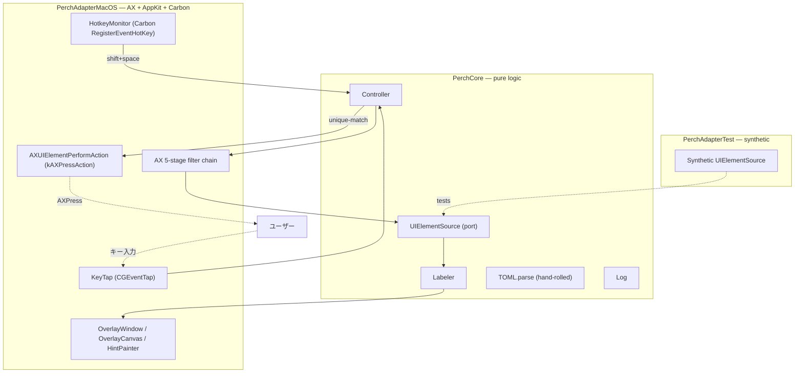

# 用語集 — perch のユビキタス言語

perch を構成する各パーツの **正規の呼び名** をまとめた規範ドキュメント。
**コード・ドキュメント・コミットメッセージ・PR タイトル・Claude Code への
プロンプト、すべてここに載っている名前のみを使う**。同義語は揺らぎを生む。
1 つに決めて、それで通す。

なお **正規名は英語のまま** 保持する。コード識別子・設定キー・CLI フラグ
（`UIElementSource`, `HotkeyMonitor`, `[hotkey].active`, `--dump-ax` など）
と一対一に対応させるため。日本語化するのは説明文だけ。

用語が足りなければ、その用語を導入する PR で同時にこのファイルへ追記する。
用語名を変える場合は、コード・ドキュメント・このファイルを **同一 PR で**
書き換える。

> 各エントリの形式: **正規名**, 1〜2 行の定義, 設定 / コードでの所在,
> そして `Don't call it:` 行 — このエントリが置き換える誤った呼び名のリスト。

---

## アーキテクチャ全体像

perch は **ヘキサゴナル 3 層分割**（[docs/architecture.md](architecture.md)）。
下の図は層と主要な seam、そして hint mode のキーストロークが辿る経路を示す。

---

## レイヤー / モジュール

### PerchCore
**純ロジック層**。CoreGraphics OK、AppKit / AX / Carbon は持ち込まない。
XCTest で単体検証可能。
- 場所: [`Sources/PerchCore/`](../Sources/PerchCore/)
- 含むもの: `Models`, `UIElementSource` protocol, `Controller`, `Labeler`,
  `TOML.parse`, `Log`
- **Don't call it:** domain layer, business logic, ドメイン層

### PerchAdapterMacOS
**OS adapter**。AX 列挙、Carbon `RegisterEventHotKey`、`NSPanel` overlay、
`AXPress` のすべてがここに閉じる。
- 場所: [`Sources/PerchAdapterMacOS/`](../Sources/PerchAdapterMacOS/)
- **Don't call it:** native adapter, ax adapter, AX 層

### PerchAdapterTest
**synthetic UIElementSource** を提供する end-to-end labeling test 用 adapter。
- 場所: [`Sources/PerchAdapterTest/`](../Sources/PerchAdapterTest/)
- **Don't call it:** mock adapter, fake adapter, モックアダプタ

### UIElementSource (port)
Core と Adapter の **唯一の seam**（hexagonal port）。Controller は
`UIElementSource` のみを見る。新規列挙戦略（Electron AX / CGWindowList
fallback 等）は新しい conformer として追加し、Core には `#if` を入れない。
- 定義: [`Sources/PerchCore/UIElementSource.swift`](../Sources/PerchCore/UIElementSource.swift)
- **Don't call it:** element provider, ax source, 列挙ソース

---

## ドメインモデル

### hint
**画面上にラベル付きで表示される 1 つのクリック対象**。AX `UIElement` +
割当てられた `label` + 描画矩形のセット。`hint mode` の主役。
- コード: `Hint` 値型, `Hint.label`
- **Don't call it:** target, marker, tag, ターゲット

### label
hint に割当てられた **短い文字列**（1〜2 文字）。これを順にタイプすると
そのhint がクリックされる。
- 不変条件: **single-letter labels は two-letter labels の prefix と
  ぶつからない**（`Labeler` がアルファベット末尾を prefix letter に予約）
- コード: [`Sources/PerchCore/Labeler.swift`](../Sources/PerchCore/Labeler.swift)
- **Don't call it:** key, code, hint key, ヒントキー

### UIElement
1 つのクリック可能 AX エレメント。**`PerchCore` 側は値型として保持**、
adapter 側が `liveById: [String: AXUIElement]` の side-table を持って
`press(id:)` 時に lookup する。Core に `AXUIElement` を **持ち込まない**。
- id 形式: `"<pid>:<seq>"`（`seq` は enumeration スコープの monotonic counter）
- **Don't call it:** ax element, ui node, AX ノード

### AX target
**hint mode が作用するウィンドウ**。`activate()` 時の
`NSWorkspace.frontmostApplication` で **一度だけ** 解決し、その後 focus が
動いても元の AX target を見続ける。
- **Don't call it:** focused window, active window, frontmost window
  （実装の途中段階を指す時のみ可）

### action mode
**修飾キーで切り替わる resolution アクション**:
- 修飾なし → `.press`（既定 = `AXUIElementPerformAction(kAXPressAction)`）
- Cmd → `.copyTitle` / Alt → `.focus` / Shift → `.rightClick`
- Ctrl は **cancel**（システムショートカット保護）
- 解決ロジック: `actionFor(flags:)` in
  [`OverlayWindow.swift`](../Sources/PerchAdapterMacOS/OverlayWindow.swift)
- **Don't call it:** modifier mode, chord, モディファイア組合せ

### unique-match
タイプ中の文字列が **1 つの [[label]] にしか合致しない瞬間**、即座に発火する
振る舞い。`single-letter` ≠ `two-letter prefix` invariant が前提。
- **Don't call it:** prefix match, instant fire, 確定マッチ

---

## 入力 / 描画

### HotkeyMonitor
**起動トリガ**を担う Carbon `RegisterEventHotKey` ラッパ。NSEvent global
monitor は使わない（passive で event を swallow できないため、focused text
field に space が入ってしまう）。
- 設定キー: `[hotkey].active`（`combo` ではない / typo は default に silent
  fallback）
- コード: [`Sources/PerchAdapterMacOS/HotkeyMonitor.swift`](../Sources/PerchAdapterMacOS/HotkeyMonitor.swift)
- **Don't call it:** activation hotkey, global hotkey（一般名としては可）,
  アクティベーションキー

### KeyTap
**hint mode 中のキー捕捉** に使う `CGEventTap`。System-wide に key を捕り、
`nil` を返して swallow しつつ perch を activate しない。`NSApp.activate` +
`NSEvent` local monitor を使わない理由は、focus が "ユーザーの足元から
持ち上がる" UX 違和感を避けるため。
- コード: [`Sources/PerchAdapterMacOS/KeyTap.swift`](../Sources/PerchAdapterMacOS/KeyTap.swift)
- **Don't call it:** key listener, key handler, キーハンドラ

### OverlayWindow / OverlayCanvas / HintPainter
hint を描画する **唯一の UI surface**。`NSPanel`（`[.borderless,
.nonactivatingPanel]`）に `NSVisualEffectView`（`.hudWindow`,
`.behindWindow`）を下、`HintPainter` を上に重ねる two-layer canvas。
- 場所: [`Sources/PerchAdapterMacOS/OverlayWindow.swift`](../Sources/PerchAdapterMacOS/OverlayWindow.swift)
- **Don't call it:** hint hud, overlay panel, ヒント表示

### pill
1 つの [[label]] を表す **角丸の小カード**。10pt corner radius を
`NSBezierPath(roundedRect:xRadius:yRadius:)` で描画（layer-level
`cornerRadius` は HiDPI で破綻する）。idle と matched で枠 / glow が変化。
- **Don't call it:** chip, badge, hint card, バッジ, チップ

### scale-in animation
hint mode 起動時の 150ms `0.85 → 1.0` ease-out cubic 拡大アニメーション。
ブラー mask を 1/60s で re-layout して painter と lockstep に保つ。
- 設定: `[overlay].anim-enabled`
- **Don't call it:** zoom-in, intro animation, ズームイン

### miss flash
未マッチ keystroke を `typed` に保持しつつ overlay を 200ms 赤く点滅させる
UI フィードバック。
- 駆動: `flashThenCancel` in `OverlayWindow`
- **Don't call it:** error flash, red flash, エラーフラッシュ

---

## AX walk

### AX 5-stage filter chain
AX 列挙の 5 段フィルタ。各段は web-shell apps の **具体的な failure mode**
を 1 つ潰すため存在する。診断ログ
`ax: bounds … → filter=…` / `ax: de-dup M → N` は `Log.line`（常時 ON）。
1. visible-children walk
2. role allow-list
3. `supportsPress`
4. `insideWindow`（Quartz bounds clamped to visibleFrame）
5. `dedupNearOverlaps`
- 詳細: [docs/architecture.md](architecture.md) "AX filter chain"
- **Don't call it:** ax pipeline, element filter, AX フィルタ

### `--dump-ax`
**現在の frontmost app に対し perch が [[label]] しようとする AX エレメント
すべてを列挙して print** する診断コマンド。"見えるはずの要素が出ない" 系
バグの triage 一発目。
- **Don't call it:** ax debug, dump elements, AX ダンプ

---

## 追加モード

### ScrollMode
hint mode と **排他** な並列モード。`CGEvent.scrollWheelEvent` を focused
window に注入。perch は focus を取らないので scroll はユーザー caret の
位置に届く。`gg` / `Shift+g` で top / bottom（20 大ノッチで OS の clamp に
任せる）。
- **Don't call it:** scroll feature, vim scroll, スクロール機能

### SearchMode
hint mode と排他な並列モード。**進入時に AX 列挙を cache** し、各キーストローク
ごとに in-memory フィルタする（再列挙しない）。digit `1-9` 解決は
match list が非空のときだけ有効化（"v2" / "API 3" のクエリ文字を保つ）。
- **Don't call it:** filter mode, search feature, 検索モード（一般名は可）

### MenuMode (menu-bar search)
issue #52。**前面アプリのメニューバー全体を fuzzy 検索** するモード。
`AXUIElementSource.enumerateMenu()` が `kAXMenuBarAttribute` を再帰的に
歩いて全 `AXMenuItem` を `"File > Save As…"` のような path 付きで列挙、
`SearchMode` の query パイプを `.verticalList` レンダリングで再利用。
発火は `AXUIElementPerformAction(kAXPressAction)` で他と共通。
visible でないコマンド（Safari の `Develop > Empty Caches` 等）に keyboard
で到達できる。エントリは `perch --menu`（CLI only）。
- **Don't call it:** menu launcher, command palette, コマンドパレット

### RegionalMode (regional hint mode)
issue #34。**大きいコンテナ**（Group / Article / Section / SplitGroup /
ScrollArea / Outline / Image, frame >= 200×100）に label を割当てる
hint mode の変種。`UIElementSource.enumerateRegions()` が AX walk を
別 policy で実行（`kAXPressAction` 不要 / 大型 floor / 役割切替）。
オーバーレイ・ラベル解決・action mode（Cmd → copyTitle が主用途）は
hint mode と共通。エントリは `perch --regional`（CLI only — Carbon
hotkey は持たない）。
- **Don't call it:** region select, container hint, regional select, リージョン選択

### WalkPolicy
`AXUIElementSource` の AX walker に渡す per-enumeration フィルタ knob。
`nativeRoles` / `webRoles` / `minWidth` / `minHeight` / `requirePress`。
hint mode と regional mode は同じ walker を共有し、policy だけが違う。
- **Don't call it:** walk options, walker config, walker パラメータ

### SearchRenderMode
`SearchMode` の **マッチ描画戦略** を選ぶ enum。`.pillsOverElements` は
各マッチの AX frame に番号付き pill を被せる従来の `--search` 挙動、
`.verticalList` はクエリ strip 直下に中央寄せの縦リストを描く（`--menu`
は frame `.zero` のため必須）。`SearchCanvas` がこの値で draw 分岐する。
- **Don't call it:** result layout, result mode, 結果表示モード

---

## 設定

### `config.toml`
リポジトリルートの `config.toml` が **source-of-truth テンプレート**。
ユーザーは `curl` して `~/.config/perch/config.toml` に置く。**読むだけ**
（書かない / 自動生成しない）。
- **Don't call it:** settings, preferences, ユーザー設定

### typo-tolerance policy
**TOML 全キーは out-of-range / unknown を default に clamp**（reject しない）。
typo で hint mode が壊れない設計。`perch --validate` が明示の検証パス。
- **Don't call it:** silent fallback, lenient mode, 寛容モード

### per-app override
`[behavior."<bundle-id>"]` セクションで `[behavior]` の `roles` /
`min-size` / `auto-click-on-unique` を **bundle id 単位で差し替え**。
未設定キーは global にフォールバックし、セクション追加だけで他キーは
消えない（typo-tolerance policy の延長）。`AXUIElementSource.enumerate`
と `OverlayWindow` が frontmost bundle に対して `PerchConfig.effectiveX(for:)`
で解決する。
- **Don't call it:** per-bundle config, app-specific settings, アプリ別設定

### WebArea discovery
**walker が `AXWebArea` を観測した bundle を runtime allow-list に昇格**
（`AXUIElementSource.discoveredWebBundles`）。静的 `chromiumPrefixes` に
無い WKWebView 内包アプリ（Books, Mac App Store, Slack の通知フライアウト,
ネイティブ + 埋め込み Web view）が対象。session-lifetime（daemon 再起動で
リセット）。promote 後は `prewarm` / `enumerate` の wake gate を
Chromium bundle と同じ扱いで通過。`/tmp/perch.log` の
`ax: WebArea in non-listed bundle <bid> → promoted` と
`/tmp/perch.status` の `discovered-web-bundles:` 行が triage 用の surface。
- **Don't call it:** runtime allow-list (general), 動的検出, dynamic detection

---

## デバッグ / ログ

### `PERCH_DEBUG`
**verbose ログの唯一のトリガ**（環境変数）。`--debug` フラグは無い
（facet / chord / wand / eventfx / glance 家系と統一）。`./run.sh`
（と `./run.sh --dev`）が立てる。
- **Don't call it:** --debug, --verbose, ログモード

### `/tmp/perch.log`
verbose trace 出力先。`PERCH_DEBUG=1` 時は stderr にもミラー。
- **Don't call it:** debug log, trace file, トレースログ

### `perch --doctor`
**macOS / Accessibility / config / daemon / screens / frontmost / log file**
を一度に self-check するコマンド。bug report の最有用な triage 添付。
- **Don't call it:** healthcheck, sanity, セルフチェック

---

## エントリ追加時のルール

- 1 つの概念につき正規名は 1 つ。複数の呼び方が流通しているなら、
  このファイルで勝者を選び、敗者は `Don't call it:` 行に並べる。
- 正規名は **英語のまま** 書く。コード識別子（`UIElementSource`,
  `HotkeyMonitor`, `OverlayCanvas`）はその表記を維持する。
- 定義は **1〜2 文** に収める。動作の詳細は設定セクションやソース
  ファイルへリンクし、ここで説明し直さない。
- 既存の単語と意味が重なるもの（`hint` vs `label` vs `UIElement` 等）は
  必ず差分が分かる定義文を置く。曖昧なら新しい正規名を選び直す。
