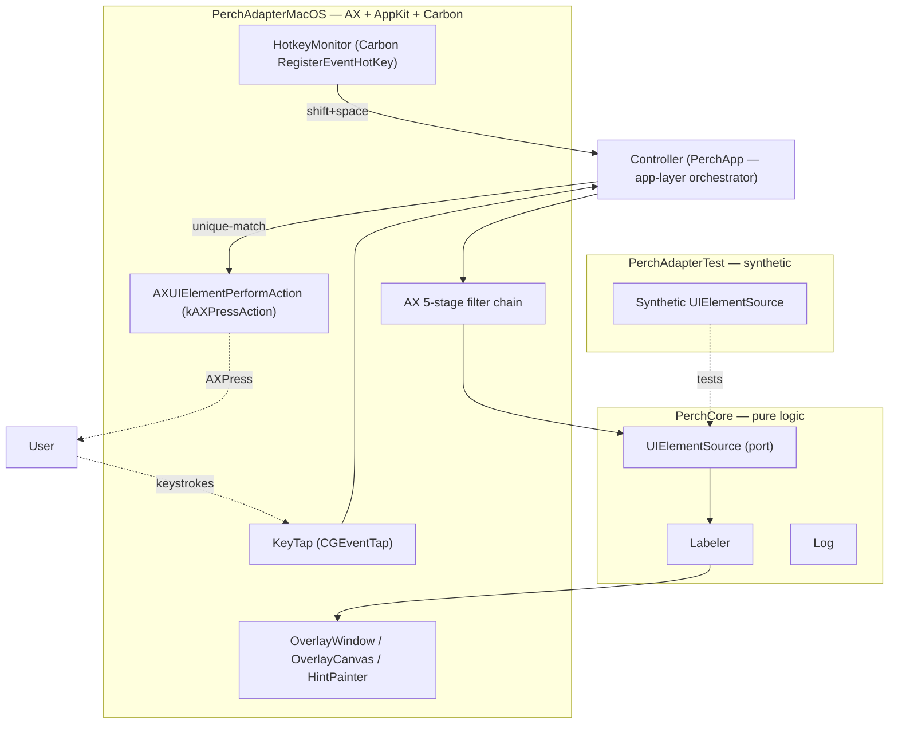

# Glossary — perch's ubiquitous language

The normative document collecting the **canonical names** for every part of
perch. **Code, docs, commit messages, PR titles, and prompts to Claude Code all
use only the names listed here.** Synonyms breed drift: pick one name and use
it everywhere.

Canonical names are kept **in English**, in one-to-one correspondence with code
identifiers, config keys, and CLI flags (`UIElementSource`, `HotkeyMonitor`,
`[hotkey].active`, `ax --dump`, …).

When a term is missing, add it to this file in the same PR that introduces it.
When a term is renamed, rewrite the code, the docs, and this file **in the same
PR**.

> Entry format: **canonical name**, a 1–2 line definition, where it lives in
> config / code, and a `Don't call it:` line — the wrong names this entry
> replaces.

---

## Architecture overview

perch is a **hexagonal three-layer split**
([docs/architecture.md](architecture.md)). The diagram below shows the layers,
the main seams, and the path a hint-mode keystroke travels.

```mermaid
flowchart TB
  subgraph CORE["PerchCore — pure logic"]
    SOURCE["UIElementSource (port)"]
    LABELER["Labeler"]
    LOG["Log"]
  end
  subgraph ADAPTER["PerchAdapterMacOS — AX + AppKit + Carbon"]
    AXENUM["AX 5-stage filter chain"]
    HOTKEY["HotkeyMonitor (Carbon RegisterEventHotKey)"]
    KEYTAP["KeyTap (CGEventTap)"]
    OVERLAY["OverlayWindow / OverlayCanvas / HintPainter"]
    PRESS["AXUIElementPerformAction (kAXPressAction)"]
  end
  subgraph TEST["PerchAdapterTest — synthetic"]
    SYNTH["Synthetic UIElementSource"]
  end
  USER["User"]
  CTRL["Controller (PerchApp — app-layer orchestrator)"]
  HOTKEY -->|shift+space| CTRL
  CTRL --> AXENUM
  AXENUM --> SOURCE
  SOURCE --> LABELER
  LABELER --> OVERLAY
  USER -.keystrokes.-> KEYTAP
  KEYTAP --> CTRL
  CTRL -->|unique-match| PRESS
  PRESS -.AXPress.-> USER
  SYNTH -.tests.-> SOURCE
```

---

## Layers / modules

### PerchCore
**The pure-logic layer.** CoreGraphics is OK; AppKit / AX / Carbon never enter.
Unit-verifiable with XCTest.
- Location: [`Sources/PerchCore/`](../Sources/PerchCore/)
- Contains: `Models`, the `UIElementSource` protocol, `Labeler`, `Log`
  (`Controller` is app-layer [`Sources/PerchApp/`](../Sources/PerchApp/);
  config parsing is the external swift-toml-edit `Toml`)
- **Don't call it:** domain layer, business logic

### PerchAdapterMacOS
**The OS adapter.** AX enumeration, Carbon `RegisterEventHotKey`, the `NSPanel`
overlay, and `AXPress` are all confined here.
- Location: [`Sources/PerchAdapterMacOS/`](../Sources/PerchAdapterMacOS/)
- **Don't call it:** native adapter, ax adapter, AX layer

### PerchAdapterTest
The adapter providing a **synthetic UIElementSource** for end-to-end labeling
tests.
- Location: [`Sources/PerchAdapterTest/`](../Sources/PerchAdapterTest/)
- **Don't call it:** mock adapter, fake adapter

### UIElementSource (port)
The **single seam** between Core and Adapter (the hexagonal port). Controller
sees only `UIElementSource`. A new enumeration strategy (Electron AX /
CGWindowList fallback, …) is added as a new conformer — never an `#if` inside
Core.
- Definition: [`Sources/PerchCore/UIElementSource.swift`](../Sources/PerchCore/UIElementSource.swift)
- **Don't call it:** element provider, ax source

---

## Domain model

### hint
**One click target shown on screen with a label.** The set of an AX
`UIElement` + its assigned `label` + a drawing rect. The protagonist of
`hint mode`.
- Code: the `Hint` value type, `Hint.label`
- **Don't call it:** target, marker, tag

### label
The **short string** (1–2 characters) assigned to a hint. Typing it in order
clicks that hint.
- Invariant: **single-letter labels never collide with the prefix of a
  two-letter label** (`Labeler` reserves the tail of the alphabet for prefix
  letters)
- Code: [`Sources/PerchCore/Labeler.swift`](../Sources/PerchCore/Labeler.swift)
- **Don't call it:** key, code, hint key

### UIElement
One clickable AX element. **`PerchCore` holds it as a value type**; the adapter
keeps a `liveById: [String: AXUIElement]` side-table and looks it up on
`act(id:as:)`. `AXUIElement` **never enters** Core.
- id format: `"<pid>:<seq>"` (`seq` is a monotonic counter scoped to one
  enumeration)
- **Don't call it:** ax element, ui node

### AX target
**The window hint mode acts on.** Resolved **exactly once** from
`NSWorkspace.frontmostApplication` at `activate()`; if focus moves afterwards,
perch keeps looking at the original AX target.
- **Don't call it:** focused window, active window, frontmost window (OK only
  when referring to the intermediate implementation step)

### action mode
**The resolution action selected by modifier keys**:
- no modifier → `.press` (default = `AXUIElementPerformAction(kAXPressAction)`)
- Cmd → `.copyTitle` / Alt → `.focus` / Shift → `.rightClick`
- Ctrl is **cancel** (protects system shortcuts)
- Resolution logic: `actionFor(flags:)` in
  [`OverlayWindow.swift`](../Sources/PerchAdapterMacOS/OverlayWindow.swift)
- **Don't call it:** modifier mode, chord, modifier combination

### unique-match
The behaviour that fires immediately **the moment the typed string matches
exactly one [[label]]**. Depends on the `single-letter` ≠ `two-letter prefix`
invariant.
- **Don't call it:** prefix match, instant fire

---

## Input / rendering

### HotkeyMonitor
The Carbon `RegisterEventHotKey` wrapper that owns the **activation trigger**.
An NSEvent global monitor is not used (it is passive and cannot swallow the
event, so the space would land in a focused text field).
- Config key: `[hotkey].active` (not `combo`; a typo silently falls back to the
  default)
- Code: [`Sources/PerchAdapterMacOS/HotkeyMonitor.swift`](../Sources/PerchAdapterMacOS/HotkeyMonitor.swift)
- **Don't call it:** activation hotkey, global hotkey (OK as the generic term)

### KeyTap
The `CGEventTap` used to **capture keys during hint mode**. Captures keys
system-wide, returns `nil` to swallow them, and never activates perch. The
reason `NSApp.activate` + an `NSEvent` local monitor are not used: it avoids
the UX oddity of focus being "lifted from under the user's feet".
- Code: [`Sources/PerchAdapterMacOS/KeyTap.swift`](../Sources/PerchAdapterMacOS/KeyTap.swift)
- **Don't call it:** key listener, key handler

### OverlayWindow / OverlayCanvas / HintPainter
The **only UI surface** that draws hints. A two-layer canvas: an `NSPanel`
(`[.borderless, .nonactivatingPanel]`) with an `NSVisualEffectView`
(`.hudWindow`, `.behindWindow`) below and `HintPainter` on top.
- Location: [`Sources/PerchAdapterMacOS/OverlayWindow.swift`](../Sources/PerchAdapterMacOS/OverlayWindow.swift)
- **Don't call it:** hint hud, overlay panel

### pill
The **small rounded card** representing one [[label]]. The 10pt corner radius
is drawn with `NSBezierPath(roundedRect:xRadius:yRadius:)` (layer-level
`cornerRadius` breaks on HiDPI). Border / glow differ between idle and matched.
- **Don't call it:** chip, badge, hint card

### scale-in animation
The 150ms `0.85 → 1.0` ease-out-cubic scale-up animation when hint mode
starts. The blur mask is re-laid-out at 1/60s to stay in lockstep with the
painter.
- Config: `[overlay].anim-enabled`
- **Don't call it:** zoom-in, intro animation

### miss flash
The UI feedback that flashes the overlay red for 200ms while keeping the
unmatched keystroke in `typed`.
- Driven by: `flashThenCancel` in `OverlayWindow`
- **Don't call it:** error flash, red flash

### theme palette
The palette expressing a [[pill]]'s background / primary / foreground + font
kind. The static catalog is the shared library **sill**'s `ThemeSpec`
(`canonicalThemeNames` — terminal / dracula / … plus the cross-app chomp /
rainbow); perch resolves it with one app-specific overlay on top (pill
translucency = `perchPillAlpha`, derived from sill's `isLight`) via
`perchThemeSpec`. The miss-flash colour uses sill's `error` role as-is.
`system` is perch's own dark-pill spec. User-defined palettes
(`[overlay.themes.<name>]` — see [[custom palette]]) are a full `ThemeSpec`.
The catalog is fully shared with facet (background / primary / foreground /
font all match).
- Location: [`Sources/PerchCore/Theme.swift`](../Sources/PerchCore/Theme.swift)
  (bridge) / sill's `Palette` module (catalog)
- Config: `[overlay].theme`
- **Don't call it:** colorway, skin, color theme

### pill shape
The [[pill]]'s body-geometry preset — pill / square / circle / underline /
tag. A knob orthogonal to the theme palette (colour).
- Config: `[overlay].pill-shape`
- Resolution: `HintPainter.shapeFor(cfg:hint:rect:)`
- **Don't call it:** pill geometry, hint shape

### appear effect
The animation when the overlay appears (none / pop / cascade / fade-in /
drop-in / bloom / random). `pop` is the 150ms scale-in (the old
[[scale-in animation]]). cascade adds a per-pill time offset for a wave feel.
- Config: `[overlay.effect].appear`
- Driven by: `OverlayCanvas.currentAppearState`
- **Don't call it:** intro animation, entry animation

### match effect
The animation played on the winning pill when a hint resolves. none / fade /
explode / drop / rise / slide-left / slide-right / vibrate / fireworks /
confetti / random. Fires in parallel with AXPress, so the click is never
delayed.
- Config: `[overlay.effect].match`
- Driven by: `OverlayCanvas.animateMatch`
- **Don't call it:** resolve animation, click effect

### unmatch effect
The animation layered on top of [[miss flash]] (shake / vibrate / fade / drop /
…). Shares the red-flash window while the motion amplifies the "wrong!"
feedback.
- Config: `[overlay.effect].unmatch`
- Driven by: `OverlayCanvas.animateUnmatch`
- **Don't call it:** miss animation, error effect

### narrow effect
The "ghost" animation run for each pill that disappears as the typed prefix
narrows the set. fireworks / confetti auto-degrade to fade for load reasons.
- Config: `[overlay.effect].narrow`
- Driven by: `GhostDriver` ([`Sources/PerchAdapterMacOS/GhostDriver.swift`](../Sources/PerchAdapterMacOS/GhostDriver.swift))
- **Don't call it:** filter animation, exit effect

### effect intensity
The **amplitude multiplier** for all effects (subtle 0.6× / normal 1.0× / bold
1.6× / wild 2.5×). Affects explode's scale factor / shake's swing / particle
velocity — not duration. Vocabulary shared with wand.
- Config: `[overlay.effect].intensity`

### duration scale
The **time multiplier** for all effects (0.1..5.0). 2.5+ for screencasts, 0.5
or below for the snappy crowd. The red-flash window follows it too.
- Config: `[overlay.effect].duration-scale`

### border cycle
The effect that cycles the neon border colour around each [[pill]] over time.
Since sill 1.10 it shares the **same** `Effects` as facet (`borderEffectFor` →
`resolveBorder`; the home-grown hue-rotation table is gone).
neon/cyber/vapor/kawaii blend each preset's palette; rainbow rotates the full
hue circle. The 30Hz tick only drives redraw (phase math lives in sill = pure).
- Config: `[overlay.border]` (effect / glow / width / cycle-seconds)
- Driven by: `OverlayCanvas.startBorderCycle` (perch owns the redraw clock)
- **Don't call it:** rainbow border, hue rotation

### modifier badge
The auxiliary UI that draws a ⌃⌥⇧⌘ glyph (+ optionally the action verb "Copy" /
"Right" / "Focus" / "Chain") in each pill's top-right corner while a modifier
is held during hint mode.
- Config: `[overlay].show-modifier-badge` (off / glyph / action)
- Driven by: `HintPainter.drawModifierBadge` + `KeyTap.onFlagsChanged`
- **Don't call it:** modifier glyph, action label

### ParticleDriver
The standalone `@MainActor` class in charge of the fireworks / confetti
effects. Takes a list of emitter points and advances each particle's
(x, y, vx, vy, alpha) at 60Hz.
- Location: [`Sources/PerchAdapterMacOS/ParticleDriver.swift`](../Sources/PerchAdapterMacOS/ParticleDriver.swift)
- **Don't call it:** particle system, fireworks renderer

### GhostDriver
The standalone class in charge of the narrow effect's ghost pills. Manages
multiple spawns concurrently; each ghost drops off the list when its duration
elapses.
- Location: [`Sources/PerchAdapterMacOS/GhostDriver.swift`](../Sources/PerchAdapterMacOS/GhostDriver.swift)
- **Don't call it:** ghost manager, exit driver

### SoundPlayer
In charge of the match / unmatch / activate audio feedback. Accepts both macOS
system sound names (`NSSound(named:)`) and file paths (`~/foo.mp3` etc.,
tilde-expanded).
- Location: [`Sources/PerchAdapterMacOS/SoundPlayer.swift`](../Sources/PerchAdapterMacOS/SoundPlayer.swift)
- Config: `[overlay.sound]`
- **Don't call it:** audio feedback, sound effects manager

### ConfigWatcher
The `DispatchSourceFileSystemObject`-based watcher that detects a save of
`~/.config/perch/config.toml` and fires `Controller.reload(cause: "fs")`.
150ms debounce + fd reopen to survive editor renames.
- Location: [`Sources/PerchApp/ConfigWatcher.swift`](../Sources/PerchApp/ConfigWatcher.swift)
- **Don't call it:** auto-reloader, file monitor

### PillPlacement
The enum switching `OverlayCanvas`'s pill anchor position —
`.elementTopLeft` (hint-mode default) / `.elementCenter` (grid mode). The seam
that lets different modes reuse the same canvas.
- Location: [`Sources/PerchAdapterMacOS/OverlayCanvas.swift`](../Sources/PerchAdapterMacOS/OverlayCanvas.swift)
- **Don't call it:** pill anchor, label placement

### custom palette
A user-defined [[theme palette]] declared in an `[overlay.themes.<name>]`
section. Searched before the built-in catalog. Since PR #95 the **plural
`themes`** is required (the singular `theme` collides with the scalar selector,
so strict TOML 1.0 rejects it and perch also emits a deprecation warning and
silently ignores it).
- Config: the pill-bg / accent / text / miss / pill-bg-alpha / font fields of
  `[overlay.themes.<name>]` (resolved to a full `ThemeSpec`)
- Resolution order: custom → sill catalog (`paletteFor`) → `system`
- **Don't call it:** user theme, custom theme (custom palette is canonical in
  English too)

### theme override
The **session override** that swaps the theme dynamically via
`perch overlay --theme <name>`. Accepts a built-in name or a
[[custom palette]] name. Applies to every activation until cleared by
`daemon --reload` or `overlay --theme ''` (empty). Controller's
`themeOverride: String?` + `effectiveConfig()` +
`PerchConfig.withTheme(_:customName:)` cooperate to rebuild the config
snapshot dynamically only while the override is active.
- Location: [`Sources/PerchApp/Controller.swift`](../Sources/PerchApp/Controller.swift)
  `applyThemeOverride` / `effectiveConfig`
- Use: temporarily switching to flashy mode for screencasts / presentations
- **Don't call it:** runtime theme, theme flag

---

## AX walk

### AX 5-stage filter chain
The five-stage filter of AX enumeration. Each stage exists to kill one
**concrete failure mode** of web-shell apps. The diagnostic logs
`ax: bounds … → filter=…` / `ax: de-dup M → N` are `Log.line` (always on).
1. visible-children walk
2. role allow-list
3. `supportsPress`
4. `insideWindow` (Quartz bounds clamped to visibleFrame)
5. `dedupNearOverlaps`
- Details: [docs/architecture.md](architecture.md) "AX filter chain"
- **Don't call it:** ax pipeline, element filter

### `ax --dump`
The diagnostic command that **enumerates and prints every AX element perch
would [[label]] in the current frontmost app**. The first triage step for
"an element that should be visible doesn't get a hint" bugs.
- **Don't call it:** ax debug, dump elements

### `ax --tree`
The diagnostic command that prints the **raw AX tree of the focused window**
(depth-first, before the 5-stage filter). When `ax --dump` misses an expected
element, this separates "it never reached the AX layer" from "the filter
dropped it". Essential when investigating web shells (Chrome / Electron /
WKWebView).
- **Don't call it:** raw ax dump, full tree dump

### `ax --regions`
Enumerates the large containers the [[regional]] mode would label, in the same
format as `ax --dump`. Used to check which containers get picked up when
tuning `[regional].min-width / min-height`.
- **Don't call it:** regional debug, container dump

---

## Additional modes

### ScrollMode
A parallel mode **mutually exclusive** with hint mode. Injects
`CGEvent.scrollWheelEvent` into the focused window. perch never takes focus,
so the scroll lands at the user's caret. `gg` / `Shift+g` for top / bottom
(20 large notches, letting the OS clamp). Issue #56 added the **count buffer**
(`5j` → 5 notches, capped at 200) and the vim-orthodox
**`Ctrl+d` / `Ctrl+u` / `Ctrl+f` / `Ctrl+b`** bindings (`d` / `u` kept as
aliases).
- **Don't call it:** scroll feature, vim scroll

### SearchMode
A parallel mode mutually exclusive with hint mode. **Caches the AX enumeration
on entry** and filters in memory per keystroke (never re-enumerates). Digit
`1-9` resolution is enabled only while the match list is non-empty (so query
characters like "v2" / "API 3" survive).
- **Don't call it:** filter mode, search feature (OK as the generic term)

### MenuMode (menu-bar search)
Issue #52. The mode that **fuzzy-searches the frontmost app's whole menu
bar**. `AXUIElementSource.enumerateMenu()` walks `kAXMenuBarAttribute`
recursively and enumerates every `AXMenuItem` with a path like
`"File > Save As…"`, reusing `SearchMode`'s query pipe with `.verticalList`
rendering. Firing goes through the shared
`AXUIElementPerformAction(kAXPressAction)`. Reaches commands with no visible
UI (Safari's `Develop > Empty Caches`, …) from the keyboard. Entry:
`perch overlay --menu` (CLI only).
- **Don't call it:** menu launcher, command palette

### chord-suffix action mode
Issue #57 + #70 + #72. The OverlayWindow state machine offering
**modifier-free alternative action selection** after a bare resolve (no
modifier). Enabled when `[chord].leader` (default empty = OFF) is non-empty.
Two phases: `<leader><action-char>`.

action-char mapping:
- `c` copyTitle / `o` revealInFinder / `u` copyURL / `s` speakTitle (#57)
- `m` synthCmdClick / `h` synthShiftClick (#70 / M4-ε)
- `d` doubleClick / `t` tripleClick (#72 / M4-η)
- `g` nestedGrid (#74 / M5+): re-subdivide the chosen element with GridMode —
  small elements fall back to AXPress

Each phase falls back to `.press` after `[chord].timeout-ms` (default 600ms).
`Esc` aborts the press itself. The modifier paths (Cmd / Shift / Alt /
Cmd+Shift) are unaffected and work as before. `m` / `h` / `d` / `t` are the
AX-bypass carve-out (`CGEvent` synthesis; `d`/`t` use
`kCGMouseEventClickState` 1/2/3 so macOS's `-[NSEvent clickCount]` reads a
genuine multi-click; the cursor does jump).
- **Don't call it:** keyboard chord, chord input (OK as the generic term)

### AX shortcut annotation
Issue #58. Draws each `overlay --menu` pill's **AX-bound keyboard shortcut**
(`⌘Q` / `⇧⌘N` etc., macOS-standard glyph order `⌃⌥⇧⌘<key>`) in a dimmed
colour at the pill's right edge. `AXUIElementSource.readMenuShortcut(_)` reads
`AXMenuItemCmdChar` + `AXMenuItemCmdModifiers` (a Carbon-style bitmask:
bit3=NoCommand, hence `mods & 8 == 0` means ⌘ included) and stores it in
`UIElement.shortcut`. `SearchCanvas.pillTextParts(...)` falls back to an empty
gutter both for opt-out (`[overlay].show-shortcuts = false`) and for
shortcut-less items (most of them) — row width is unified to the rows that
have shortcuts, so the Spotlight-style alignment never breaks.
`AXMenuItemCmdVirtualKey` / `AXMenuItemCmdGlyph` (function keys / Tab /
arrows) are follow-up work.
- **Don't call it:** menu hint, shortcut hint (OK as the generic term)

### DragMode (keyboard drag-and-drop)
Issue #69 (M4-δ). For **UI drag operations** hint mode can't reach (Finder
column resize / Safari tab reordering / NSSplitView / list reordering, …).
A two-phase state machine: `.positioning` (button not held, arrows nudge) →
`d` fires `leftMouseDown` → `.dragging` (arrows nudge + emit
`leftMouseDragged`) → `d` / space / Enter fire `leftMouseUp` → exit. Step
sizes match NudgeMode (bare 1 / Shift 10 / Alt 100 / Cmd screen edge).
**Esc is a "safe release", not a cancel** — Esc during `.dragging` fires
`mouseUp` before exiting (never leaves a `mouseDown` in the system input
queue).
- **Don't call it:** mouse drag, drag-drop mode (OK as the generic term)

### NudgeMode (arrow-nudge cursor)
Issue #68 (M4-γ). The **last-mile pixel adjustment** after
`overlay --grid` / `overlay --rgrid`. No OverlayWindow (the cursor is the
visual feedback); KeyTap alone interprets arrows + modifier steps (bare 1 /
Shift 10 / Alt 100 / Cmd screen edge) and drives
`CGWarpMouseCursorPosition` + a `mouseMoved` `CGEvent` (so hover updates).
`space` / `Enter` click → exit (modifier picks the button: bare left / Shift
right / Cmd middle). Ctrl is reserved by macOS Mission Control, so it has no
step binding.
- **Don't call it:** mouse keys, arrow cursor (OK as the generic term)

### VisionHints (overlay --vision)
Issue #73 (M5). The **final AX-bypass layer**. OCRs the main display with
Apple Vision's `VNRecognizeTextRequest` and turns each recognized text region
into a `UIElement` (id `"vision:<x>:<y>"`, role `"VisionText"`, frame = the
bounding box). Dispatch is a CGEvent centroid click (the same side-table-free
scheme as the emoji path — coordinates are encoded in the id itself). Needs
the Screen Recording TCC; when not granted, `CGDisplayCreateImage` returns nil
→ an empty enumeration as a silent fallback. Latency 100–400ms on Apple
Silicon, `.fast` recognition. The coordinate transform is (1) Vision
normalized 0..1 bottom-left → (2) pixel top-left flip → (3) point conversion
via backingScale — all three stages are required.
- **Don't call it:** ocr hints, vision overlay (OK as the generic term)

### GridMode (coordinate grid)
Issue #66 (M4-α) + #67 (M4-β). Hint mode's **AX-bypass fallback**, for regions
hint mode can't see (a Figma canvas / Photoshop / any custom-drawn UI). Splits
the screen union into `[grid].cols × [grid].rows` (default 12×8, clamped
2..32) and labels each cell with the existing `Labeler.assign(...)` (the same
alphabet as hint mode). Firing is **not AX but a `CGEvent` warp + mouse
down/up** (the cursor jump is an accepted design cost). Action mapping: bare →
left click / Shift → right / Cmd → warp only / Cmd+Shift → click + re-entry.
CLAUDE.md's "AX press never simulates a synthetic click" rule has its
**deliberate carve-out** only in the grid family (the whole M4 series).

The **`maxDepth` knob** switches between one level (`overlay --grid`, M4-α)
and recursive (`overlay --rgrid`, M4-β, default `[grid].max-depth = 3`,
clamped 1..5). In recursive mode: pick a label → drill; when the depth budget
runs out, terminal click. `space` / `Enter` go terminal from any depth;
`Backspace` pops one level. One `GridMode` class covers both; Controller's
`startGridSession(maxDepth:...)` is the seam.
- **Don't call it:** mouse grid, coordinate picker (OK as the generic term)

### EmojiPicker (emoji picker)
Issue #55. A `SearchMode` derivative whose enumerator is
`UIElementSource.enumerateEmoji()` (the curated `EmojiTable.entries` as
`UIElement`s, id `"emoji:<glyph>"`). Rendered as `.verticalList`. Firing
**injects the Unicode directly at the caret via
`CGEvent.keyboardSetUnicodeString` without stealing focus** (the adapter
branches on the `emoji:` prefix) — **the pasteboard is never touched**. Only
`.copyTitle` puts the glyph on the pasteboard. The table is a curated set of
≈400 entries (the full CLDR ≈3700 is long-tail and deliberately not covered —
niche emoji are left to the OS picker). Entry: `perch overlay --emoji`
(CLI only).
- **Don't call it:** emoji typer, emoji search (OK as the generic term)

### WindowSwitcher (cross-app window switcher)
Issue #54. A `SearchMode` derivative whose enumerator is
`UIElementSource.enumerateWindows()` (every window of every running app).
Labels are `"<App> — <Window Title>"` (minimised windows get ` (min)`),
rendered as `.verticalList` (same reason as `overlay --menu` — a window picker
is frame-independent). Firing is **AX `kAXRaiseAction` +
`NSRunningApplication.activate`** (the adapter branches on role == "Window") —
not `kAXPressAction`. `.copyTitle` puts the whole `"App — Title"` on the
pasteboard (via the `customLabelById` cache). Entry: `perch overlay --windows`
(CLI only).
- **Don't call it:** window picker, window list, cmd-tab

### RegionalMode (regional hint mode)
Issue #34. The hint-mode variant that labels **large containers** (Group /
Article / Section / SplitGroup / ScrollArea / Outline / Image, frame >=
200×100). `UIElementSource.enumerateRegions()` runs the AX walk under a
different policy (no `kAXPressAction` requirement / a large-size floor / a
different role set). The overlay, label resolution, and action mode (Cmd →
copyTitle is the main use) are shared with hint mode. Entry:
`perch overlay --regional` (CLI only — no Carbon hotkey).
- **Don't call it:** region select, container hint, regional select

### WalkPolicy
The per-enumeration filter knob handed to `AXUIElementSource`'s AX walker:
`nativeRoles` / `webRoles` / `minWidth` / `minHeight` / `requirePress`. Hint
mode and regional mode share the same walker; only the policy differs.
- **Don't call it:** walk options, walker config

### SearchRenderMode
The enum choosing `SearchMode`'s **match-drawing strategy**.
`.pillsOverElements` is the classic `overlay --search` behaviour laying
numbered pills over each match's AX frame; `.verticalList` draws a centred
vertical list right under the query strip (required for `overlay --menu`,
whose frames are `.zero`). `SearchCanvas` branches its drawing on this value.
- **Don't call it:** result layout, result mode

### SearchFilter
Issue #53. The **fuzzy subsequence ranker** shared by `SearchMode` /
`MenuMode`. Per query token: synonym expansion → subsequence match over the
label → score (word-boundary +8 / consecutive +4 / single char +1, penalties
for gaps and leading skips). Returns the elements surviving an AND match of
all tokens in descending score; ties keep input order (the no-regression
guarantee that a single keystroke never shuffles the results). Pure PerchCore
logic.
- **Don't call it:** fuzzy filter, fuzzy ranker

### search synonyms
The **bidirectional synonym groups** defined in the `[search.synonyms]`
section. With `delete = ["remove", "trash", "rm"]`, typing **any form in the
group hits labels containing any of the others**. No need to remember the
canonical key (the key/value distinction is ignored during label lookup).
`SearchFilter.expand(...)` does the expansion, scored with a small penalty
relative to a direct match.
- **Don't call it:** alias dictionary, synonyms table (OK as the generic term)

---

## Configuration

### `config.toml`
The `config.toml` at the repository root is the **source-of-truth template**.
Users `curl` it into `~/.config/perch/config.toml`. **Read-only** (perch never
writes or auto-generates it).
- **Don't call it:** settings, preferences

### typo-tolerance policy
**Every TOML key clamps out-of-range / unknown values to the default** (never
rejects). Designed so a typo can never break hint mode.
`perch config --validate` is the explicit verification path.
- **Don't call it:** silent fallback, lenient mode

### per-app override
A `[behavior."<bundle-id>"]` section **overrides `[behavior]`'s `roles` /
`min-size` / `auto-click-on-unique` per bundle id**. Unset keys fall back to
the global values, so adding a section never erases the other keys (an
extension of the typo-tolerance policy). `AXUIElementSource.enumerate` and
`OverlayWindow` resolve against the frontmost bundle via
`PerchConfig.effectiveX(for:)`.
- **Don't call it:** per-bundle config, app-specific settings

### WebArea discovery
**Promotes any bundle where the walker observed an `AXWebArea` to a runtime
allow-list** (`AXUIElementSource.discoveredWebBundles`). Targets
WKWebView-embedding apps missing from the static `chromiumPrefixes` (Books,
Mac App Store, Slack's notification flyout, native + embedded web views).
Session-lifetime (reset on daemon restart). Once promoted, the bundle passes
the `prewarm` / `enumerate` wake gates exactly like a Chromium bundle. The
triage surfaces are the `ax: WebArea in non-listed bundle <bid> → promoted`
line in `/tmp/perch.log` and the `discovered-web-bundles:` line in
`/tmp/perch.status`.
- **Don't call it:** runtime allow-list (general), dynamic detection

---

## Debugging / logging

### `PERCH_DEBUG`
The **only trigger for verbose logging** (an environment variable). There is
no `--debug` flag (unified with the facet / chord / wand / glance family).
`./run.sh` (and `./run.sh --dev`) set it.
- **Don't call it:** --debug, --verbose, log mode

### `/tmp/perch.log`
The verbose-trace destination. With `PERCH_DEBUG=1` it is also mirrored to
stderr.
- **Don't call it:** debug log, trace file

### `perch config --doctor`
The command that self-checks **macOS / Accessibility / config / daemon /
screens / frontmost / log file** in one go. The most useful triage attachment
for a bug report.
- **Don't call it:** healthcheck, sanity

---

## Rules for adding entries

- One canonical name per concept. If several names are in circulation, pick
  the winner in this file and list the losers on the `Don't call it:` line.
- Canonical names are written **in English**, keeping the exact spelling of
  code identifiers (`UIElementSource`, `HotkeyMonitor`, `OverlayCanvas`).
- Keep a definition to **1–2 sentences**. Link behaviour details to the config
  section or the source file instead of re-explaining them here.
- A term overlapping an existing word (`hint` vs `label` vs `UIElement`, …)
  must carry a definition that makes the difference visible. If it stays
  ambiguous, pick a better canonical name.
